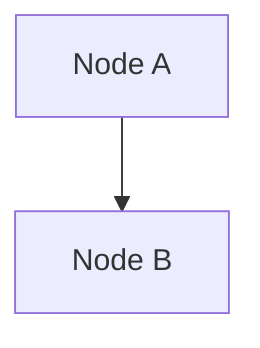

# Learn2 — architecture guide for agents

This document tells you how the **MkDocs** guide under `learn2/` is structured, how to **extend** it safely, and how to **reproduce** the same material in new Markdown files. Follow it when adding pages, splitting content, or keeping the guide aligned with the repo.

## Purpose and scope

| Artifact | Role |
|----------|------|
| `learn2/` | **MkDocs** site: Markdown sources, theme, build output. Good for search, nav, and standard docs UX. |
| `learn/coach-visual-explainer/` | **Standalone HTML** coach explainers (same *pedagogical* story, different format). |

There is **no automated sync** between the two today. When you change facts (commands, paths, package names), update **both** if both should stay accurate, or pick one as canonical and note that in the other (Hub page already points readers at the HTML folder).

**Canonical facts** for Happy live in the real repo: `README.md`, `docs/`, `docs/CONTRIBUTING.md`, and `packages/*`.

---

## Directory map

```
learn2/
  mkdocs.yml          # Site config, nav order, markdown extensions, theme
  requirements.txt    # Python deps (mkdocs-material)
  README.md           # Human: venv, serve, build, 404 troubleshooting
  ARCHITECTURE.md     # This file (agent / maintainer guide; not in MkDocs nav by default)
  docs/               # All published Markdown sources
    index.md          # Hub
    start-here.md
    how-it-works.md
    happy-server/     # packages/happy-server (multi-page guide)
    …
    stylesheets/
      extra.css       # Theme tweaks (Catppuccin-ish dark overrides)
  site/               # Generated static site (gitignored); do not edit by hand
  .venv/              # Local Python venv (gitignored)
```

- **`docs_dir`** is `docs/` — only files under `docs/` are part of the built site unless you change config.
- Files at **`learn2/*.md`** (e.g. this file) are **not** published unless you move them into `docs/` and add them to `nav`.

---

## How navigation works

The **left sidebar order and labels** come from the `nav:` key in `mkdocs.yml`:

```yaml
nav:
  - Hub: index.md
  - "01 · Start here": start-here.md
  …
```

Rules for agents:

1. **Every new page** must have a **`.md` file under `docs/`** and a **`nav:` entry** (otherwise MkDocs may still build it, but users will not see it in the sidebar unless they use search).
2. Use **stable filenames** (`kebab-case.md`). Titles in quotes can include punctuation (`"06 · Run & develop"`).
3. **`index.md`** is the site home (`/`).

---

## How to add a new page

1. Create `docs/<slug>.md` with a single top-level `# Title` (or set `title` in YAML front matter — optional).
2. Add a line to `nav:` in **`mkdocs.yml`** in the desired position.
3. Run **`.venv/bin/mkdocs build --strict`** from `learn2/` and fix any warnings/errors.
4. If the Hub lists all topics, update **`docs/index.md`** (table or list) to include the new page.
5. Optionally mirror content in **`learn/coach-visual-explainer/`** as HTML if the project keeps both in sync manually.

---

## How to reproduce the “guide” style in Markdown

Match patterns already used in `docs/*.md`:

| Pattern | Use when |
|---------|----------|
| `!!! type "Title"` | Coach framing, TL;DR, section intros. Types: `abstract`, `tip`, `note`, `warning`, `danger`, `success`, `quote`. |
| Tables | Comparisons, command matrices, “who uses what”. |
| Fenced ` ```bash ` blocks | Shell commands (copy button enabled by theme). |
| `??? question "Q"` / indented body | FAQ / collapsible Q&A (requires `pymdownx.details`). |
| ` ```mermaid ` fenced blocks | Architecture / flowcharts (see below). |
| Definition lists (`Term\n: description`) | Glossary-style entries (see `glossary.md`). |

Keep tone **plain, direct, beginner-friendly** — same as the coach HTML: short paragraphs, **bold** for the one key idea per paragraph where it helps.

---

## Mermaid diagrams

Enabled via **`pymdownx.superfences`** + `custom_fences` → `mermaid` in `mkdocs.yml`.

- Use a **fenced code block** with language `mermaid` (not HTML `<div class="mermaid">`).
- Prefer **`flowchart TD`** for readability; keep labels short.
- After edits, run **`mkdocs build`** and confirm the diagram renders in the browser (Mermaid is loaded by Material).

Example:

````markdown

````

---

## Markdown extensions (do not break these)

Configured in **`mkdocs.yml`** under `markdown_extensions:`:

- **admonition** — `!!!` blocks  
- **pymdownx.details** — `???` collapsible blocks  
- **pymdownx.superfences** — nested fences + Mermaid  
- **pymdownx.tabbed** — optional tab groups  
- **attr_list** / **md_in_html** — attributes on headings if needed (`## Section {: #anchor }`)  
- **tables** — GitHub-flavored tables  
- **toc** + **permalink** — section anchors in the right-hand TOC  

If you add exotic syntax, verify **`mkdocs build --strict`** still passes.

---

## Styling (`docs/stylesheets/extra.css`)

- Global **Material** palette is set in **`mkdocs.yml`** (`theme.palette`).
- **`extra.css`** nudges dark mode colors toward **Catppuccin Macchiato**; keep overrides **minimal** so upgrades to Material stay safe.
- Prefer theme variables (`--md-*`) over hard-coding layout unless necessary.

---

## Verification checklist (before you say “done”)

From `learn2/` with venv active:

```bash
.venv/bin/mkdocs build --strict
```

- **Zero errors**; fix warnings if they appear.
- Spot-check **`site/`** in a browser via **`mkdocs serve`** (do not rely on `file://` — see `README.md`).

---

## Extending the information architecture

- **Splitting a long page:** Add new `docs/*.md` files, wire them in `nav`, and add cross-links `[text](other-page.md)`.
- **Sections only:** Prefer `##` / `###` headings; the right-hand TOC uses them automatically.
- **Anchor links:** Use heading text or explicit IDs compatible with **`attr_list`** if the default slug is awkward.

---

## What not to do

- Do not commit **`site/`** or **`.venv/`** (they are gitignored).
- Do not hand-edit generated **`site/`** files — they are overwritten on every build.
- Do not duplicate **large** command blocks across many pages without a maintenance comment; link to **Run & develop** or **Testing** instead when possible.
- Do not assert crypto/protocol behavior without pointing to **`docs/encryption.md`**, **`docs/protocol.md`**, or code — the guide is **introductory**, not a spec.

---

## Quick reference: commands

| Task | Command |
|------|---------|
| Install deps | `python3 -m venv .venv && .venv/bin/pip install -r requirements.txt` |
| Dev server | `.venv/bin/mkdocs serve -a 127.0.0.1:8765` |
| Production build | `.venv/bin/mkdocs build` |
| Output | `learn2/site/` |

---

## Optional: publish this file in the site

To show **ARCHITECTURE** inside MkDocs:

1. Copy or move content to `docs/architecture.md` (or symlink if your OS supports it and MkDocs resolves it — copying is simpler).
2. Add `nav:` entry, e.g. `- For maintainers: architecture.md`.
3. Rebuild.

Keeping **`ARCHITECTURE.md` only under `learn2/`** avoids exposing maintainer docs to end readers who only want the Happy tour.
