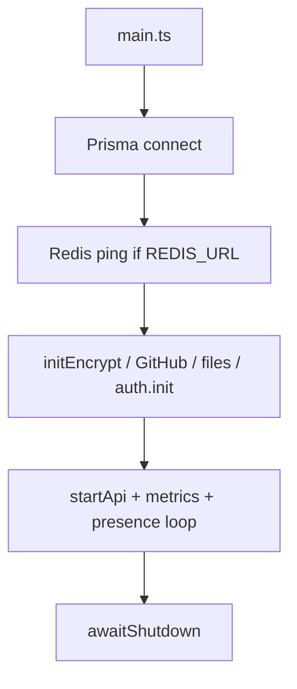

# Runtime & startup

## Two entry points

You must understand **`main.ts`** (full stack, external Postgres) **vs** **`standalone.ts`** (embedded **PGlite**, portable binary / Docker).

### `sources/main.ts` — primary development server

Used when `DATABASE_URL` points at a real **PostgreSQL** instance (local Docker, RDS, etc.). Startup sequence:

1. **`db.$connect()`** — Prisma connects to Postgres.
2. **Activity cache** — shutdown hook for presence/session cache (`activityCache.shutdown()`).
3. **Optional `REDIS_URL`** — if set, `ioredis` connects and **`ping()`** verifies connectivity.
4. **Crypto / auth init (order matters):**
   - **`initEncrypt()`** — derives **KeyTree** from `HANDY_MASTER_SECRET` (server-side secrets for GitHub/vendor tokens, *not* user message plaintext).
   - **`initGithub()`** — GitHub App / webhooks if env configured.
   - **`loadFiles()`** — S3 bucket or **local filesystem** storage for uploads.
   - **`auth.init()`** — Bearer token generation/verification (privacy-kit).
5. **Servers:**
   - **`startApi()`** — Fastify + Socket.IO (see next chapters).
   - **`startMetricsServer()`** — Prometheus metrics.
   - **`startDatabaseMetricsUpdater()`** — DB stats.
   - **`startTimeout()`** — presence **10-minute** inactive loop.
6. **`await awaitShutdown()`** — graceful shutdown on signal.



### `sources/standalone.ts` — portable / Docker single container

Goals: **no external Postgres** for the minimal image; everything in one process.

1. **Crypto patch** — normalizes JWK base64 for **Bun** compatibility (`importKey` shim at top of file).
2. **`migrate` command** — opens **PGlite** at `PGLITE_DIR`, applies SQL from `prisma/migrations/**/migration.sql`, tracks `_prisma_migrations`.
3. **`serve` command** — sets `DB_PROVIDER=pglite`, `PGLITE_DIR`, then **dynamic `import("./main")`** so the **same `main.ts`** runs with Prisma configured for PGlite via env.

So: **one codebase**, two deployment shapes — **not** two different HTTP stacks.

!!! info "CLI surface"
    Standalone responds to `happy-server migrate` and `happy-server serve` when compiled; from source: `tsx sources/standalone.ts migrate|serve`.

## Configuration

| Variable | Role |
|----------|------|
| `PORT` | HTTP listen port (default **3005**) |
| `DATABASE_URL` | Postgres DSN; **omit** + set PGlite env for embedded DB |
| `HANDY_MASTER_SECRET` | **Required** — master secret for auth/token crypto (see README) |
| `REDIS_URL` | Optional — Redis (adapter / future use; startup pings if set) |
| `DATA_DIR` / `PGLITE_DIR` | Standalone: on-disk layout for PGlite + files |
| `PUBLIC_URL` | Base URL for links returned to clients (files, etc.) |

Full tables: **`packages/happy-server/README.md`** and **`docs/deployment.md`**.

## Shutdown

`onShutdown` from `utils/shutdown.ts` registers hooks:

- Close **Fastify** (`api` handler).
- **Disconnect Prisma**.
- Flush **activity cache**.

SIGTERM-style shutdown is expected in production (Docker/K8s).

## Local commands (from monorepo root)

```bash
# Embedded PGlite + migrate + serve (typical from CONTRIBUTING)
yarn workspace happy-server standalone:dev

# Typecheck only
yarn workspace happy-server build

# Tests
yarn workspace happy-server test
```

Point the app at your server:

```bash
EXPO_PUBLIC_HAPPY_SERVER_URL=http://localhost:3005 yarn workspace happy-app start
```

---

**Previous:** [← Overview](index.md) · **Next:** [HTTP API & auth →](02-http-api-and-auth.md)
