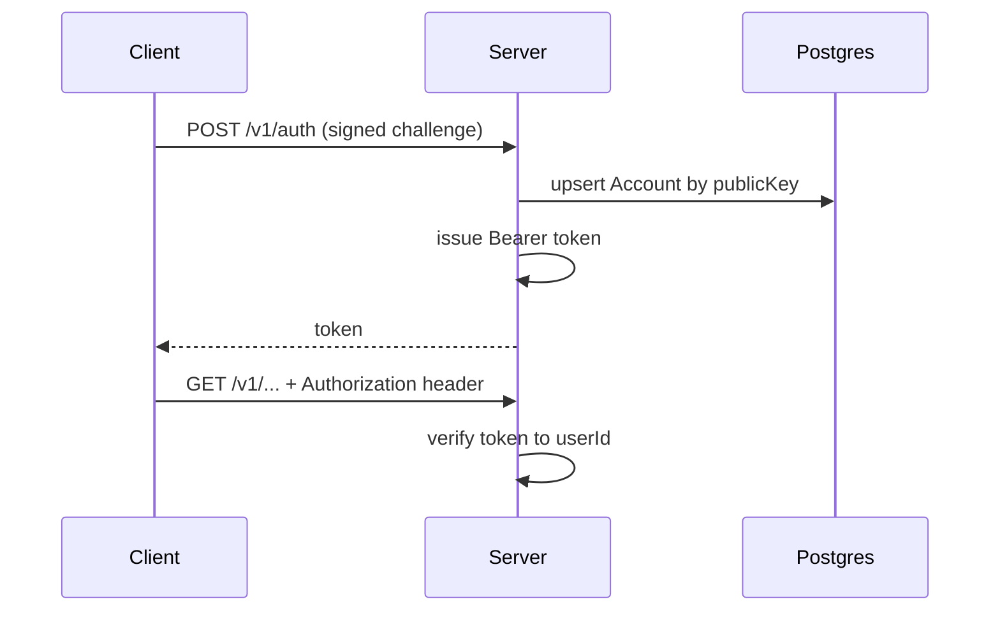

# HTTP API & authentication

## Fastify application

**`sources/app/api/api.ts`** builds the server:

- **Fastify** with **body limit 100MB** (large artifacts).
- **CORS** — `origin: '*'` for API (adjust in production if needed).
- **Zod** via `fastify-type-provider-zod` — `validatorCompiler` / `serializerCompiler` for typed routes.
- **Root** `GET /` → plain text welcome.
- **Feature hooks** (order matters):
  - `enableMonitoring` — request metrics
  - `enableErrorHandlers` — consistent errors
  - `enableAuthentication` — **`authenticate` decorator** for Bearer routes

### Local file storage

If `storage/files` reports **local storage** mode, the app registers **`GET /files/*`** with **path traversal protection** (resolved path must stay under the configured base directory).

### Route registration (conceptual groups)

Routes are **functions** imported from `sources/app/api/routes/` and registered on the typed Fastify instance:

| Area | Route module (examples) |
|------|-------------------------|
| Auth | `authRoutes` |
| Sessions | `sessionRoutes`, `v3SessionRoutes` |
| Machines | `machinesRoutes` |
| Artifacts | `artifactsRoutes` |
| Access keys | `accessKeysRoutes` |
| KV | `kvRoutes` |
| Account / usage | `accountRoutes` |
| Push | `pushRoutes` |
| Connect (GitHub + vendors) | `connectRoutes` |
| Users / feed | `userRoutes`, `feedRoutes` |
| Voice / version / dev | `voiceRoutes`, `versionRoutes`, `devRoutes` |

!!! tip "Full catalog"
    **`docs/api.md`** lists every path (`GET`/`POST`/`DELETE`) — keep it open when navigating `routes/*.ts`.

## Method conventions (from `docs/api.md`)

- **GET** — reads.
- **POST** — mutations and actions (even when not “REST pure”).
- **DELETE** — when intent is unambiguous.

This avoids forcing REST verbs where operations span entities.

## Authentication model (passwordless)

The server **does not store user passwords**. Flow:

1. Client proves control of a **keypair** via **`POST /v1/auth`** with `{ publicKey, challenge, signature }` (base64).
2. Server **upserts** `Account` by `publicKey` and returns a **Bearer token**.
3. Subsequent requests use **`Authorization: Bearer <token>`**.

Tokens are created/verified with **privacy-kit** and **`HANDY_MASTER_SECRET`**, with an **in-memory cache** for fast verification.

Additional flows (terminal pairing, account linking) live under **`/v1/auth/request`**, **`/v1/auth/response`**, etc. — see **`docs/api.md`**.

## GitHub OAuth (separate path)

GitHub uses **short-lived ephemeral tokens** for the OAuth callback path — distinct from normal Bearer session auth. See **`connectRoutes`** and **`docs/api.md`** under **Connect**.

## Socket.IO attachment

After `app.listen`, **`startSocket(typed)`** attaches Socket.IO to the **same HTTP server** — see [WebSocket & events](03-websocket-and-events.md). Path: **`/v1/updates`**.

---

**Previous:** [← Runtime](01-runtime-and-startup.md) · **Next:** [WebSocket & events →](03-websocket-and-events.md)
