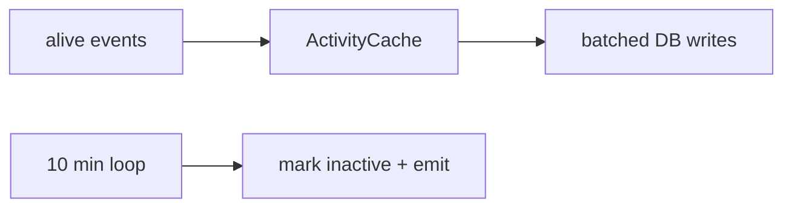

# WebSocket & realtime events

## Socket.IO server

**`sources/app/api/socket.ts`** creates a **Socket.IO** `Server` attached to Fastify’s **Node HTTP server**:

| Setting | Value |
|---------|--------|
| Path | **`/v1/updates`** |
| Transports | `websocket`, `polling` |
| Ping | `pingInterval` 15s, `pingTimeout` 45s |
| CORS | `origin: "*"` (tighten for production if needed) |

## Connection handshake

Each socket must send **`handshake.auth.token`** (Bearer token string). Optional:

- **`clientType`**: `'user-scoped' | 'session-scoped' | 'machine-scoped'` (default behaves like user-scoped).
- **`sessionId`** — **required** if `session-scoped`.
- **`machineId`** — **required** if `machine-scoped`.

The server calls **`auth.verifyToken(token)`**. On failure: **`error`** event + disconnect.

## Connection scopes (why they exist)

| Scope | Who | Receives |
|-------|-----|----------|
| **user-scoped** | Mobile / web “whole account” | Broad user updates (filtered by router) |
| **session-scoped** | Client focused on one session | Updates for that session |
| **machine-scoped** | Daemon / machine | Machine-specific streams |

Types are defined in **`eventRouter.ts`** as **`ClientConnection`** unions (`SessionScopedConnection`, `UserScopedConnection`, `MachineScopedConnection`).

## Event router

**`sources/app/events/eventRouter.ts`** is the central **fan-out** engine:

- Tracks **which sockets** belong to which **user / session / machine**.
- Emits **persistent** updates (backed by DB, with **monotonic seq**) vs **ephemeral** events (presence, not stored long-term the same way).
- Uses **recipient filters** such as:
  - `all-interested-in-session`
  - `user-scoped-only`
  - `machine-scoped-only`
  - `all-user-authenticated-connections`

Event shapes include **`new-message`**, **`new-session`**, **`update-session`**, **`update-account`**, etc. — each carries **sessionId** / **seq** / **metadata** fields as appropriate.

!!! note "Wire format"
    Field-level protocol for payloads is in **`docs/protocol.md`** and **`packages/happy-wire`** — the server enforces shapes but **message bodies remain encrypted** to the server.

## Sequence numbers

- **`Account.seq`** — per-user update counter; **`allocateUserSeq`** drives **`UpdatePayload.seq`** for user-level ordering.
- **Session / artifact** rows carry their own **`seq`** for per-object ordering.

Clients rely on these for **idempotency and ordering** after reconnect.

## Socket handler modules

Under **`sources/app/api/socket/`**, dedicated handlers include (non-exhaustive):

- **`usageHandler`**, **`rpcHandler`**, **`pingHandler`**
- **`sessionUpdateHandler`**, **`machineUpdateHandler`**, **`artifactUpdateHandler`**, **`accessKeyHandler`**

Each registers on the Socket.IO server for specific **RPC-style** or **update** channels.

## Presence & activity (linked)

High-frequency **`session-alive`** / **`machine-alive`** signals are **debounced** in **`ActivityCache`** (`sources/app/presence/sessionCache.ts`), batched to DB, and a **10-minute** timeout loop marks entities inactive. See **`docs/backend-architecture.md`** “Presence and activity”.

---

**Previous:** [← HTTP API](02-http-api-and-auth.md) · **Next:** [Database & storage →](04-database-and-storage.md)
