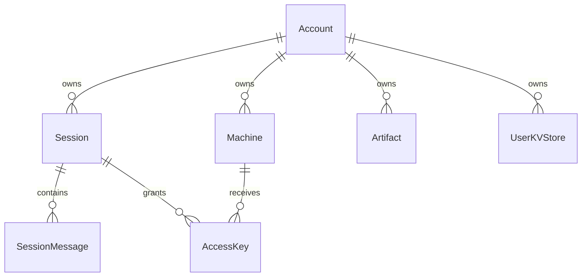

# Database & storage

## Prisma

**Schema:** `packages/happy-server/prisma/schema.prisma`  
**Client:** `sources/storage/db.ts` — imported as **`db`** across the app.

Postgres is the **default** datasource (`provider = postgresql`). **Standalone** mode uses a **driver adapter** path with **PGlite** when env sets embedded DB (see `standalone.ts` + `pgliteLoader.ts`).

## Core models (conceptual ER)

| Model | Purpose |
|-------|---------|
| **Account** | `publicKey` identity, `seq` / `feedSeq`, profile, settings, GitHub link |
| **Session** | Encrypted `metadata`, `agentState`, `dataEncryptionKey` bytes, `tag`, `seq` |
| **SessionMessage** | Message rows with encrypted content references |
| **Machine** | Daemon machine metadata + state |
| **Artifact** | Versioned encrypted blobs (`header` / `body` / `key`) |
| **AccessKey** | Per-session-per-machine encrypted keys |
| **UserKVStore** | Encrypted KV with optimistic versioning |
| **UsageReport** | Usage aggregation |
| **UserRelationship** / **UserFeedItem** | Social graph + feed |
| **TerminalAuthRequest** / **AccountAuthRequest** | Pairing flows |
| **AccountPushToken** | Push notification endpoints |
| **UploadedFile** | Metadata for S3/local uploads |

Field names in DB are **not** the user-visible plaintext chat — stored as **strings/bytes** the server treats as opaque.

## Transactions: `inTx`

**`sources/storage/inTx.ts`** wraps Prisma **serializable** transactions with:

- **Retry on `P2034`** (serialization failure).
- **`afterTx` hooks** to emit **Socket.IO updates only after commit** — avoids leaking events for rolled-back work.

Use this pattern for multi-step mutations (batch KV, session delete, etc.).

## Files: S3 or local

**`sources/storage/files.ts`** — configures **S3-compatible** client when env provides **S3** endpoints; otherwise **local directory** under `DATA_DIR` and serves via **`GET /files/*`** from Fastify.

**`uploadImage`** / processing pipeline writes **`UploadedFile`** rows and returns **public URLs** using **`PUBLIC_URL` / `S3_PUBLIC_URL`** style configuration (see code + deployment docs).

## Redis

If **`REDIS_URL`** is set, **`main.ts`** pings Redis at startup. Socket.IO can use **Redis Streams adapter** (`@socket.io/redis-streams-adapter` in package.json) for **horizontal scaling** — check current `socket.ts` and deployment for whether multi-instance is active in your environment.

## Migrations

- **Development:** `yarn workspace happy-server migrate` (Prisma migrate dev with `.env.dev`).
- **Standalone:** `standalone.ts migrate` applies raw SQL migrations to PGlite.

Always align **migration order** with `prisma/migrations/` when changing schema.

---

**Previous:** [← WebSocket](03-websocket-and-events.md) · **Next:** [Security & confidentiality →](05-security-and-confidentiality.md)
