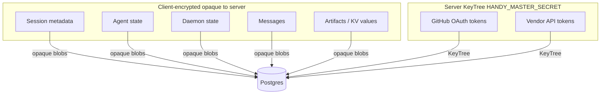

# Security & confidentiality

This section summarizes **what the server can and cannot see**. **Authoritative detail:** `docs/encryption.md` and the implementation in `sources/modules/encrypt.ts`, `sources/app/auth/`, and storage layers.

## Two encryption worlds

| Data | Who can decrypt |
|------|-----------------|
| Session metadata, agent/daemon state, messages, artifacts, KV values | **Clients** with user keys — server stores **ciphertext / base64** blobs |
| GitHub OAuth, OpenAI/Anthropic/Gemini **service** tokens | **Server** using **KeyTree** from **`HANDY_MASTER_SECRET`** |

So: **user content is E2EE from the server’s perspective**; **integration secrets** are **server-side encrypted** so the DB is not plaintext vendor keys.

## Authentication

- **No passwords** — **Ed25519-style** public key + challenge (`docs/api.md`).
- **Bearer tokens** — issued by **`auth`** module; verified on HTTP and WebSocket.

## `HANDY_MASTER_SECRET`

Required for:

- Token generation/verification (privacy-kit integration).
- **KeyTree** material for **service** token encryption.

**Rotate** with extreme care — invalidates stored service tokens unless you run a migration path.

## HTTPS and transport

Production should terminate **TLS** at the reverse proxy (nginx, Caddy, cloud LB). The Node app listens **HTTP** by default.

WebSocket path **`/v1/updates`** must be upgraded correctly through the same TLS endpoint.

## What to read next

- **`docs/encryption.md`** — boundaries and encoding.
- **`docs/api.md`** — auth endpoints.
- **`docs/protocol.md`** — WebSocket payload rules.

---

**Previous:** [← Database](04-database-and-storage.md) · **Next:** [Observability & deployment →](06-observability-deployment.md)
