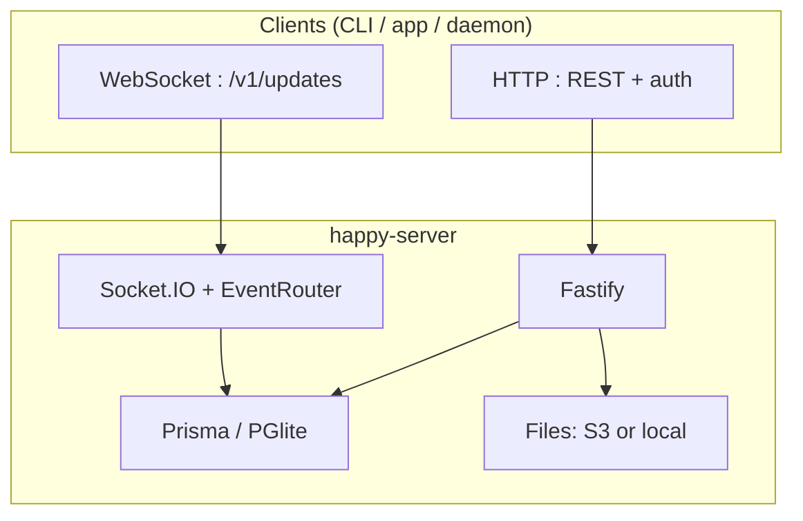

# Happy Server — full guide

!!! abstract "What you are learning"
    **`packages/happy-server`** is the **backend** for Happy: it authenticates clients, stores **opaque encrypted** session and sync data, and relays **real-time updates** over WebSockets. It is implemented in **TypeScript** on **Node.js**, with **Fastify** (HTTP), **Socket.IO** (realtime), and **Prisma** (Postgres or embedded **PGlite**).

This guide walks through **runtime**, **HTTP API**, **WebSockets & events**, **persistence**, **security boundaries**, and **operations**. It is based on **`docs/backend-architecture.md`**, **`docs/api.md`**, and the source tree — **the canonical spec is always the code** in `packages/happy-server` and the monorepo `docs/` folder.

## Mental model in one diagram

## What the server does *not* do

- It does **not** decrypt end-user session chat or agent state for its own use — those are **opaque blobs** from the server’s perspective (see [Security & confidentiality](05-security-and-confidentiality.md)).
- It is **not** the Claude / Codex / Gemini product — it **syncs and coordinates** Happy clients.

## Chapters

| # | Page | Topics |
|---|------|--------|
| 1 | [Runtime & startup](01-runtime-and-startup.md) | `main.ts` vs `standalone.ts`, lifecycle, ports, shutdown |
| 2 | [HTTP API & auth](02-http-api-and-auth.md) | Fastify, routes, Bearer auth, challenge login |
| 3 | [WebSocket & events](03-websocket-and-events.md) | `/v1/updates`, scopes, `EventRouter`, seq |
| 4 | [Database & storage](04-database-and-storage.md) | Prisma models, `inTx`, PGlite, S3, Redis |
| 5 | [Security & confidentiality](05-security-and-confidentiality.md) | E2EE blobs vs server KeyTree tokens |
| 6 | [Observability & deployment](06-observability-deployment.md) | Metrics, health, Docker, env |

## Essential monorepo references

| Document | Contents |
|----------|----------|
| `docs/backend-architecture.md` | Diagrams, subsystem list, same as much of this guide but repo-native |
| `docs/api.md` | Full HTTP endpoint catalog |
| `docs/protocol.md` | WebSocket wire protocol |
| `docs/encryption.md` | Encoding and encryption boundaries |
| `docs/deployment.md` | Hosting / infra |
| `packages/happy-server/README.md` | Docker, env vars, self-host |

## Package facts

| Item | Value |
|------|--------|
| Yarn workspace name | `happy-server` |
| Default HTTP port | `3005` (`PORT` env) |
| Socket.IO path | `/v1/updates` |
| Public cloud API (product) | `happy-api.slopus.com` (not hardcoded in this guide) |

---

**Next:** [Runtime & startup →](01-runtime-and-startup.md)
