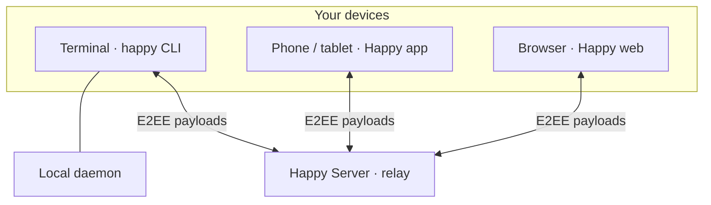

# How the pieces talk to each other

!!! abstract "Data flow & trust boundaries"
    Don’t worry — you don’t need to know every protocol detail on day one. **Start with who talks to whom** and where encryption happens.

## High-level architecture

The CLI and app are **clients**. The server is a **relay** for encrypted updates. Your development machine often runs a **daemon** so sessions stay controllable while you switch devices.

!!! quote "In short"
    Plaintext chat and code context stay on devices; the server coordinates opaque ciphertext.

## Typical session idea (not a literal sequence diagram)

| Step | What happens |
|------|----------------|
| 1 | You run **happy** (or **happy codex**) on the computer. The wrapper starts or attaches to an agent session. |
| 2 | You pair or sign in on mobile/web so another client can join the same **encrypted** conversation stream. |
| 3 | When you step away, you can still **monitor or steer** from the app; the daemon on the desktop keeps the bridge alive. |
| 4 | When you are back at the keyboard, you can resume local control — product copy describes switching with a keypress. |

For wire formats and sequencing, read `docs/protocol.md` and related files when you are ready.

## FAQ

??? question "Does the server see my source code?"
    It should not see plaintext session content — that is the E2EE design. Always verify against the current `docs/encryption.md` and server code for the exact boundaries.

??? question "Why WebSockets?"
    Real-time sync across devices needs persistent, low-latency connections — a natural fit for WS, described in `docs/protocol.md`.

??? question "What is “remote mode”?"
    Marketing/docs describe switching between local and remote control of the same session; implementation details live under `docs/session-protocol*.md`.
